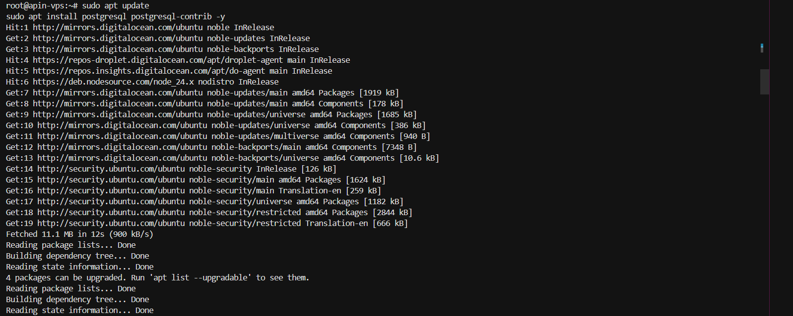
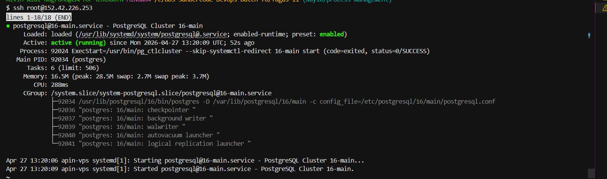
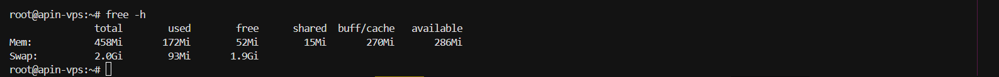
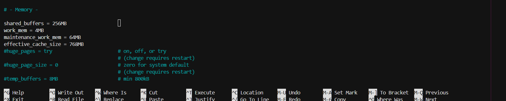
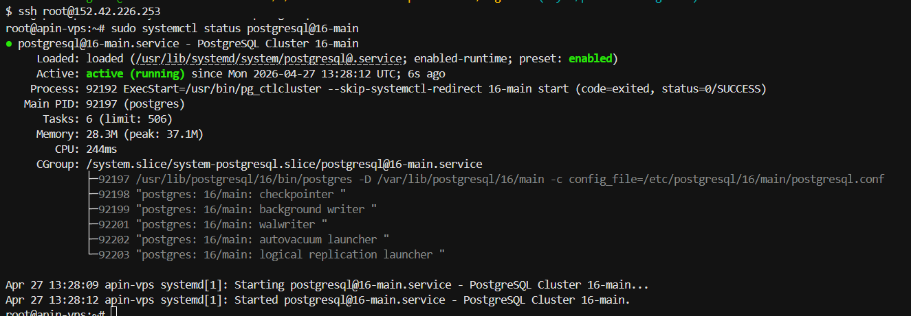
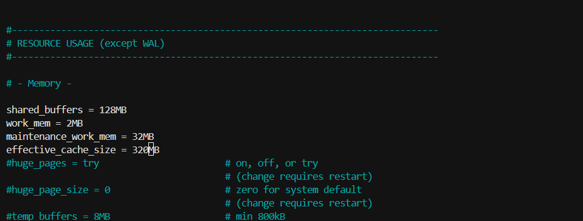
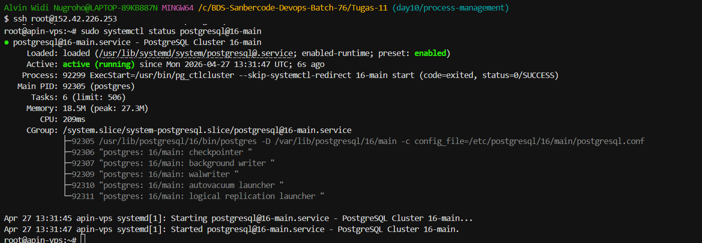
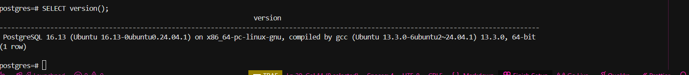

### Install Postgres

### DB Sudah Running

### RAM VPS

### Shared Buffers dan Config Tambahan

### Setelah diubah

### Shared Buffers dan Config Diubah

### Final

## Postgres

## KESIMPULAN
Konfigurasi PostgreSQL disesuaikan dengan kapasitas RAM VPS (~512MB) untuk menghindari over-allocation memory dan menjaga stabilitas sistem.