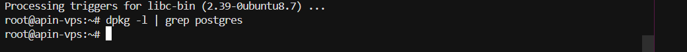
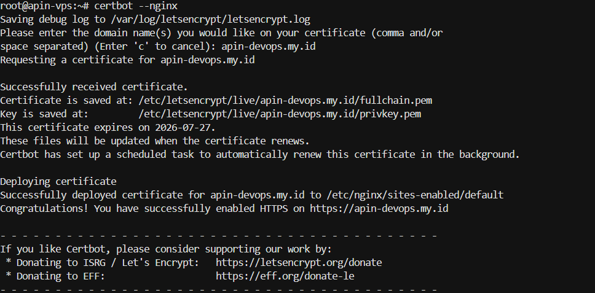

## Evidence Cleaning

## Evidence DNS

## Evidence Certbot

## Evidence HTTPS

## Evidence Config
root@apin-vps:~# cat /etc/nginx/sites-available/apin-devops
server {
    listen 80;
    server_name apin-devops.my.id www.apin-devops.my.id;

    location / {
        proxy_pass http://localhost:3000;
        proxy_set_header Host $host;
        proxy_set_header X-Real-IP $remote_addr;
    }
}

# PERTANYAAN
Kenapa sih kita harus rajin melakukan apt purge atau menghapus servis yang nggak kepakai kayak MySQL/Postgres tadi sebelum kita instal SSL dan rilis ke publik? Apa hubungannya sama keamanan dan performa server?
## Jawaban
Saya melakukan instalasi postgres pada Tugas-11, namun diabaikan. Itu bisa menjadi celah brute force (paksa) login, sehingga celah keamanan jadi lebih rentan. Postgres merupakan database, dan kemarin saya memilih 512 MB, mereka memakan RAM yang cukup besar. Pada faktanya saya hanya butuh  Node/Golang + NGINX. Kecuali memang sudah ranah microservice dengan database. Postgres dihapus supaya aplikasi lebih ringan, NGINX lebih responsif. Intinya hilangkan service-serivce yang tidak perlu (contoh, postgres dalam tugas ini)