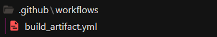
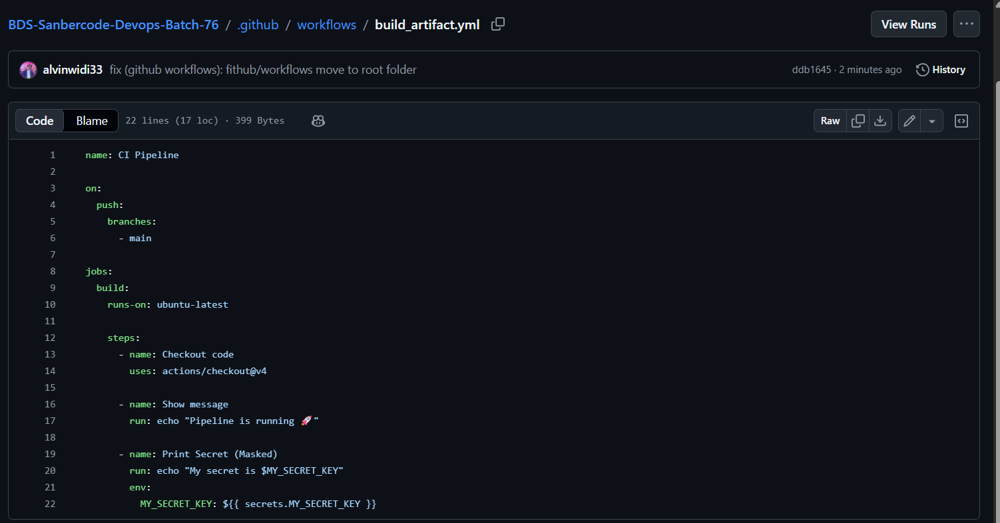
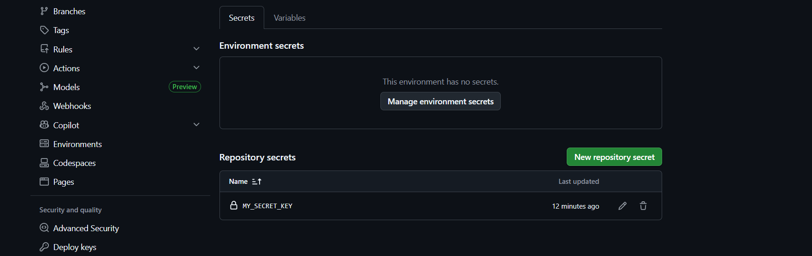
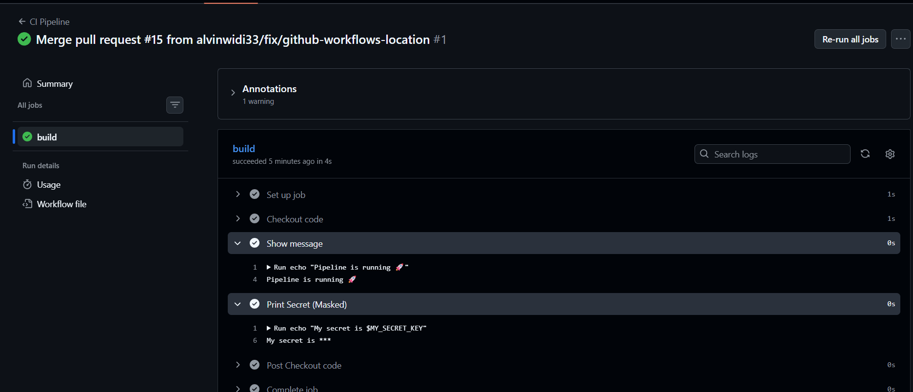

## Bikin Folder .github/workflows


## Isi folder tersebut dengan build_artifact.yml
```
name: CI Pipeline

on:
  push:
    branches:
      - main

jobs:
  build:
    runs-on: ubuntu-latest

    steps:
      - name: Checkout code
        uses: actions/checkout@v4

      - name: Show message
        run: echo "Pipeline is running 🚀"

      - name: Print Secret (Masked)
        run: echo "My secret is $MY_SECRET_KEY"
        env:
          MY_SECRET_KEY: ${{ secrets.MY_SECRET_KEY }}
```
Berikut **screenshot** repo


## Buat SECRET_KEY
Taroh pada **Settings → Secrets and variables → Actions**
Klik **New repository secret**


## Bukti centang hijau dan secret key
