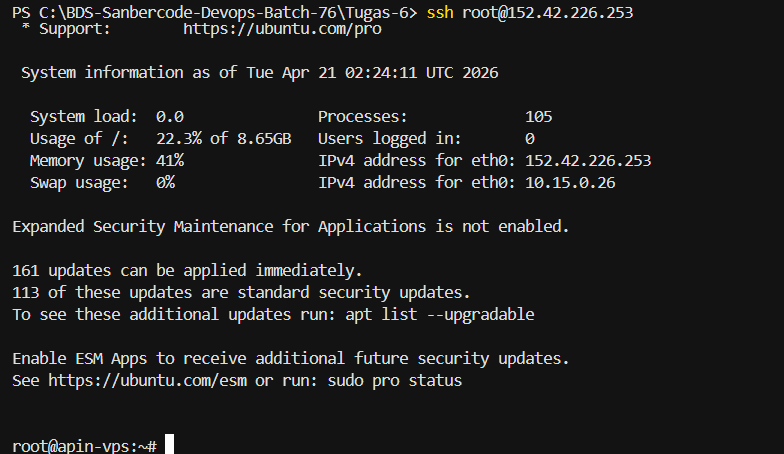
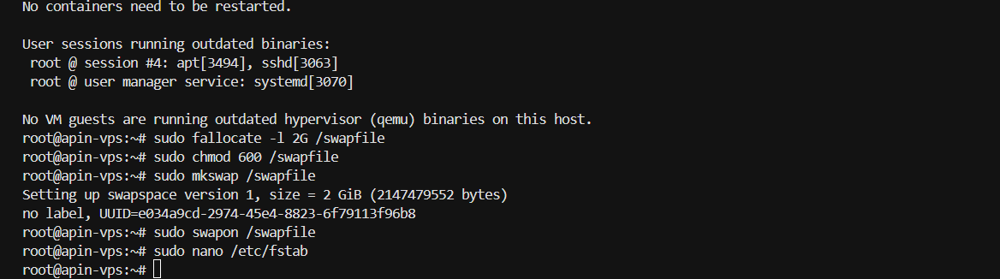
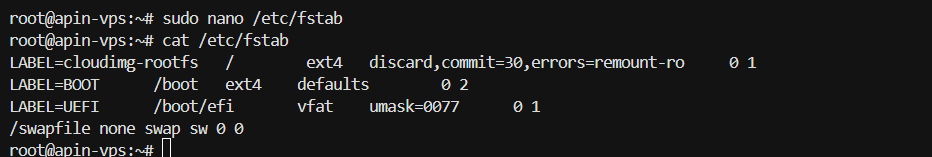
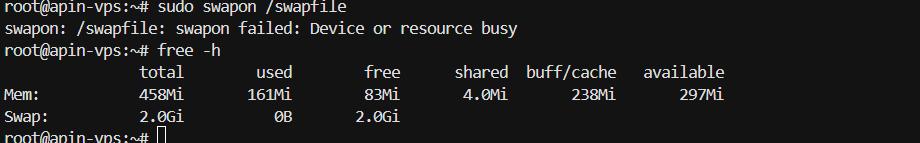

SSH ROOT

sudo apt update && sudo apt upgrade -y

sudo fallocate -l 2G /swapfile
sudo chmod 600 /swapfile
sudo mkswap /swapfile
sudo swapon /swapfile

cat /etc/fstab

free -h

Swap = `backup RAM`
Bukan buat nambah performa, tapi biar server tidak crash
Kalau swap sering kepakai → tanda harus upgrade RAM